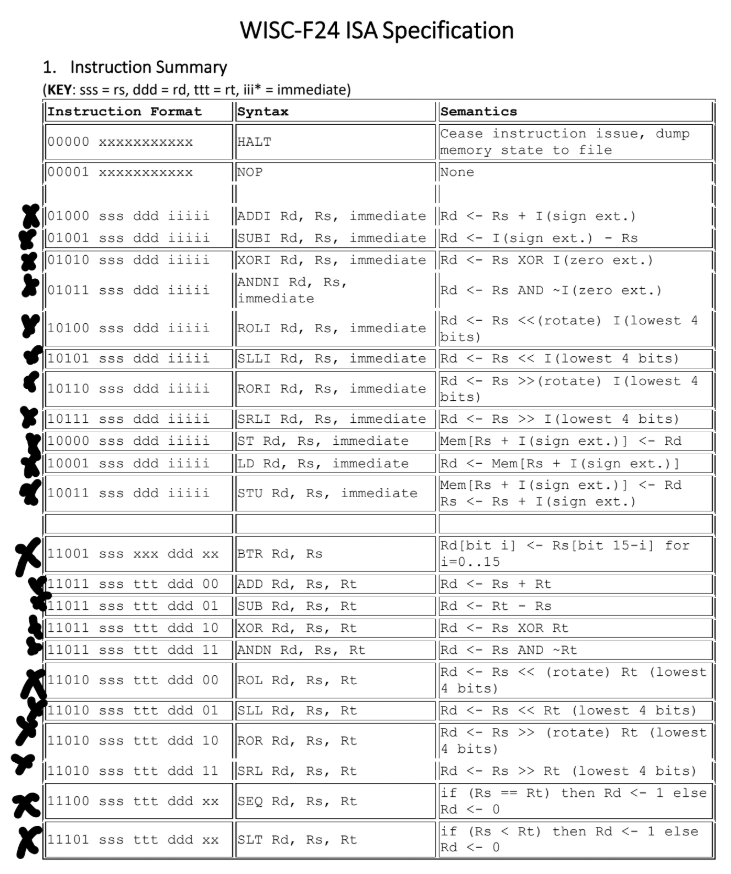
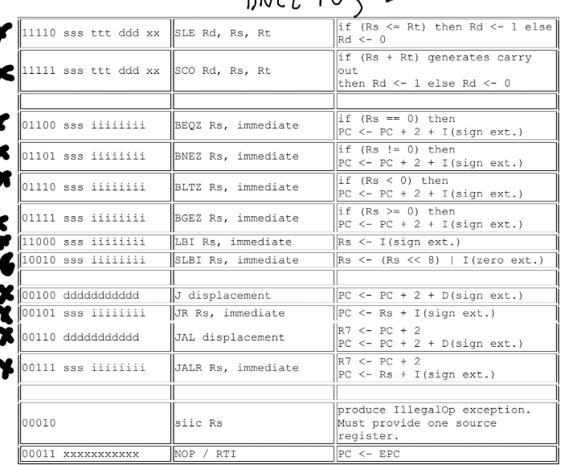

### 🔭 Semester-Long Project: 5-Stage Pipelined Processor  

As part of a team of three, we designed and implemented a **5-stage pipelined processor** with advanced architectural features, including **branch prediction, data forwarding, and instruction & data caches**. The project was developed in incremental stages over the semester, allowing us to build a strong foundation before integrating performance optimizations.  

[Fall_24_552_Project_ISA.pdf](Fall_24_552_Project_ISA.pdf)

#### 🏗️ Development Process:  
- **Initial Design**: We began by creating a **schematic based on an ISA**, defining the instruction formats, registers, and control signals.  
- **Single-Cycle Processor**: We implemented a baseline **single-cycle design** to ensure correct execution of instructions.  
- **Pipelining**: We transformed the processor into a **5-stage pipeline** (Fetch, Decode, Execute, Memory, Write-back), introducing pipeline registers to handle data flow.  
- **Performance Optimizations** (extra paths for extra credit):  
  - **Branch Prediction**: Implemented a branch predictor to reduce control hazards and improve instruction throughput.  
  - **Data Forwarding**: Introduced forwarding paths to minimize stalls due to data dependencies from RAW hazards.  
  - **Caches**: Integrated instruction and data caches, first in direct, and then two-way set associative.

### Final Schematic: 

#### 🛠️ Technologies & Tools:  
- **Hardware Description Language**: Verilog.
- **Simulation & Debugging**: ModelSim 
- **Collaboration**: [Harrison Doll](https://github.com/fuzzy41316/fuzzy41316), [Keeton Kowalski](https://github.com/keetongh), & [Samuel Cooper](https://github.com/Samcooper01)

### WISC-F24 ISA

